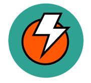
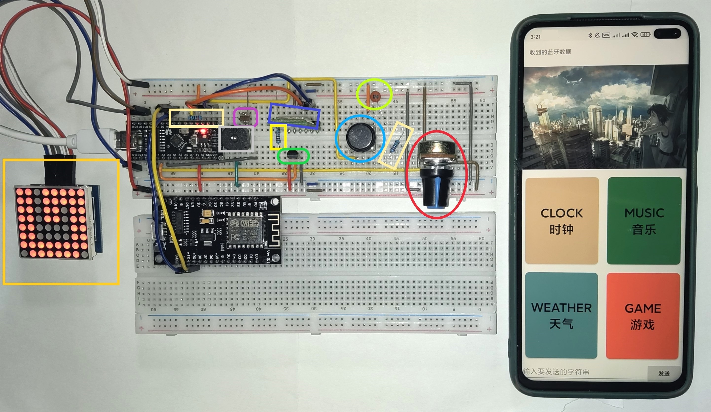

## DuckBox IoT System

### **Project Description:**

`DuckBox` is an intelligent IoT system.

This project consists of three main components: `DuckBox` as the main hardware, `DuckBox Core` as the system program running on `DuckBox`, and `DuckBox Helper` as the companion mobile application.

**Overall Project Demonstration:**

As shown in the figure, the hardware system constructed on the breadboard on the left is `DuckBox`, and the mobile phone on the right is running the `DuckBox Helper` application.

From left to right, the interfaces of `DuckBox Helper` include the device interface, function interface, and four modules: clock, weather, music, and games.

**APP Download:**

**Hardware Schematic:**

**`DuckBox Core`** Flowchart:

