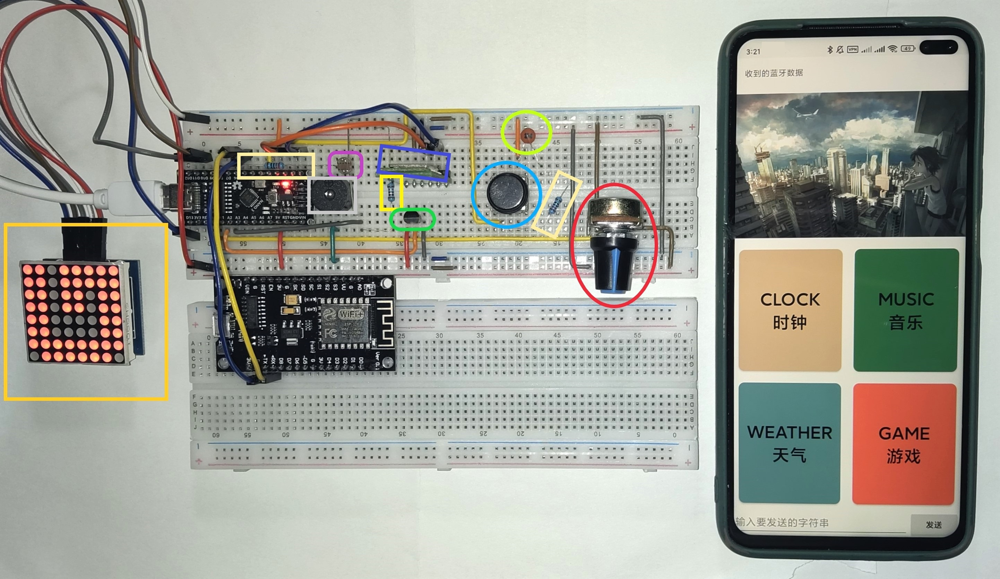
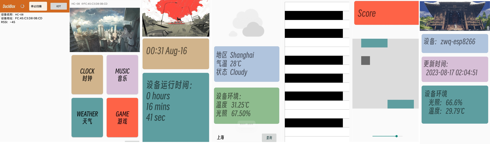
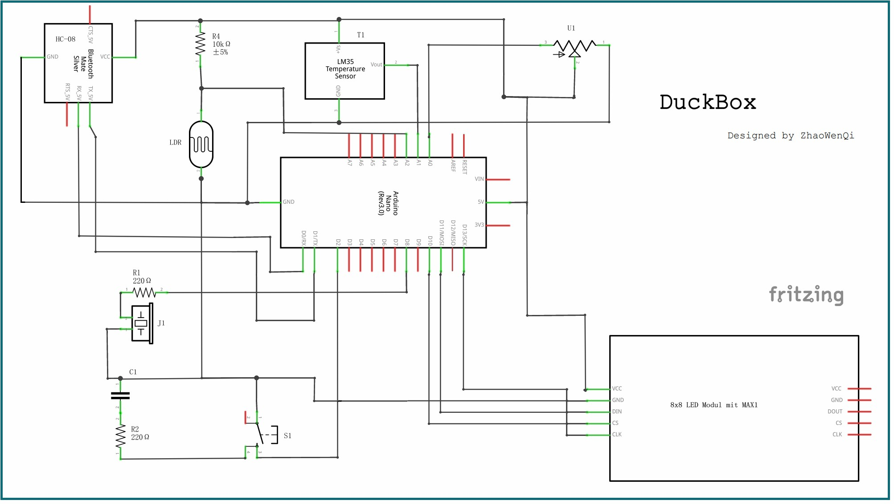
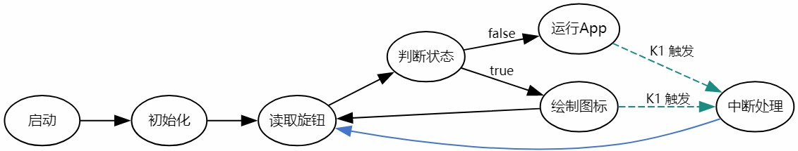

## DuckBox  :tw-1f427: 智能物联网终端

### **项目说明：**

​	根据《创客实践》课程期末考查方案相关要求，`DuckBox` 是以 `Arduino Nano 3` 开发板为核心实现的智能软硬件物联网系统。

​	本项目共包含三个组成部分：`DuckBox` 为主体硬件，`DuckBox Core`为`DuckBox`上运行的系统程序， `DuckBox Helper`是与之相配套的手机应用程序。

**整体项目效果展示：**

如图所示，左侧在面包板上连接构成的硬件系统为 `DuckBox`，右侧为一部正在运行 `DuckBox Helper` 的手机。

从左到右，依次为 `DuckBox Helper`的设备界面、功能界面，以及时钟、天气、音乐、游戏这四个模块。

**硬件原理图：**

**`DuckBox Core `** 运行流程图：

